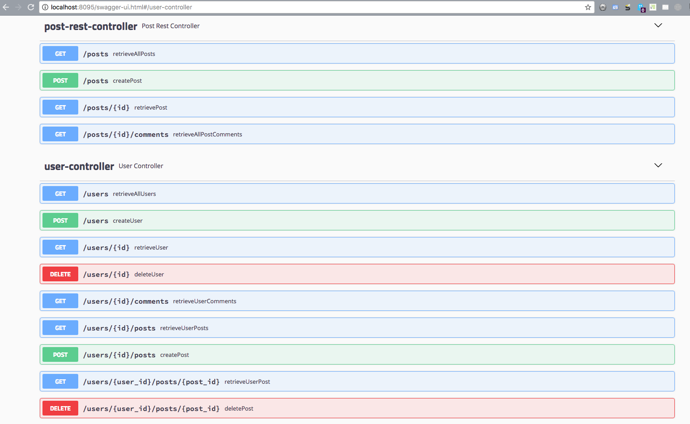
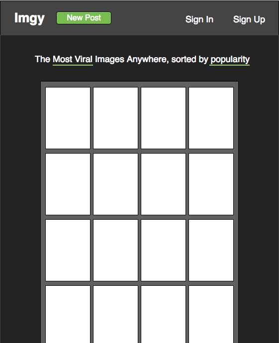
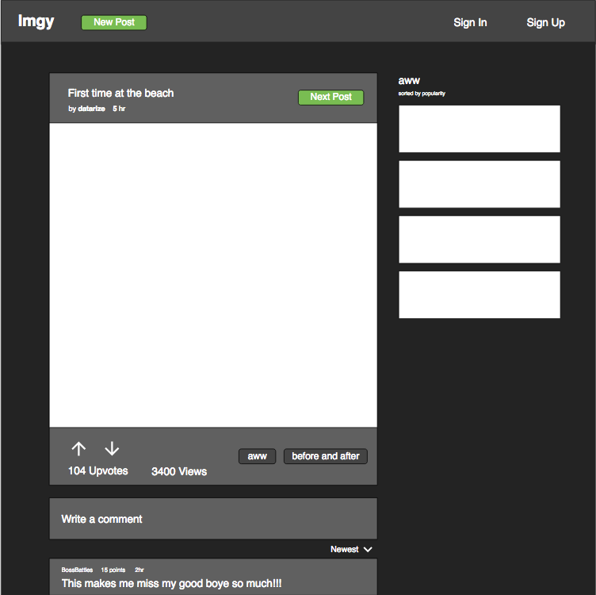
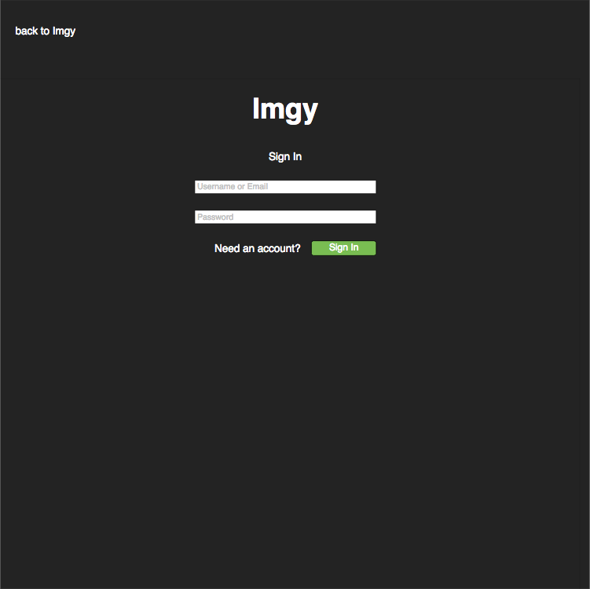

# Imgy RESTful API backend

This is an on-going project to create a clone of the Imgur photo sharing site.  This is the RESTful api backend, which is done in Java and performs CRUD operations to MySQL tables.  There is also a React frontend that make calls to the backend REST api in response to user actions.

## Imgy Frontend

https://github.com/jeffmt/imgy_frontend

## Swagger visualization of Rest API

## Wireframe Prototypes of frontend

